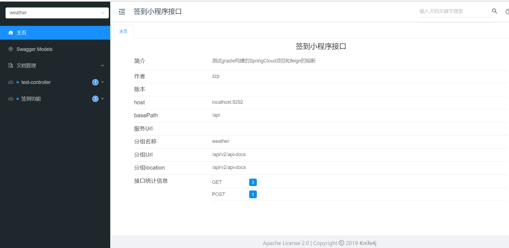
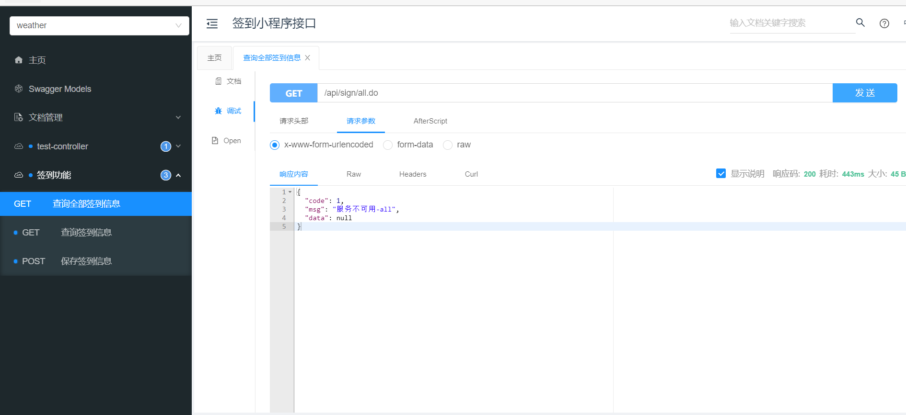

# study-parent
练习使用gradle构建springCloud项目

####
SpringCloudAlibaba项目选址【study_alibaba分支即可】

#### 介绍
使用网飞方案，有feign+zuul+hystrix+knife4j，简单的分布式签到+服务降级，主要体现使用gradle构建项目

study_alibaba分支是使用阿里巴巴方案实现相同功能的签到+服务降级，同样有着分布式knife4j页面展示

#### 效果
**主页**

**降级测试**
